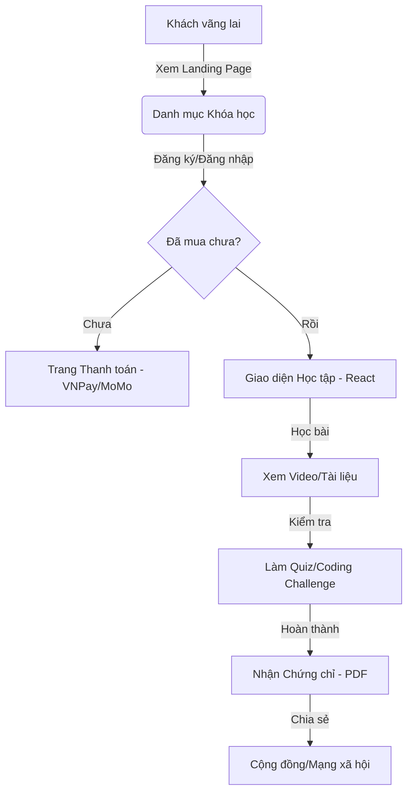
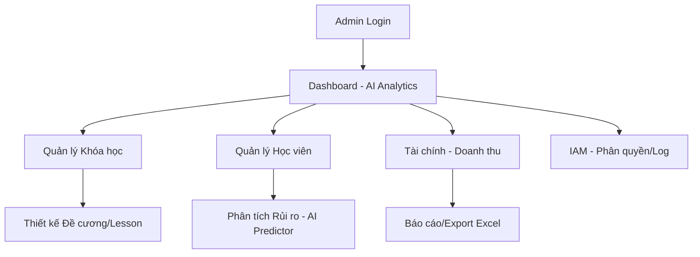

# 🗺️ SmartLMS System Flowchart & Architecture

Tài liệu này tổng hợp các luồng vận hành và các phân hệ của hệ thống SmartLMS để phục vụ việc tư duy và mở rộng.

---

## 1. 🌊 Luồng Người Dùng Chính (User Flows)

### A. Luồng Học Viên (Student/React Portal)

### B. Luồng Quản trị (Admin - ASP.NET Portal)

---

## 2. 🏗️ Các Phân hệ Hệ thống (Subsystems)

Hệ thống của bạn đang được chia thành các "vương quốc" sau:

1.  **LMS Core Engine:** Quản lý Course, Module, Lesson, Quiz.
2.  **E-Commerce & Billing:** Cổng thanh toán, Hóa đơn, Affiliate.
3.  **AI Integration Engine:** Dự báo rủi ro học viên, đề xuất khóa học.
4.  **IAM (Identity & Access Management):** Ma trận quyền, Nhật ký vận hành (Audit).
5.  **Community (Phân hệ đang tách):** Diễn đàn, Thảo luận, Vote bài viết.
6.  **Infrastructure Services:** S3 Storage, Redis Cache, RabbitMQ Bus.

---

## 3. 🔍 Các tính năng chưa có luồng hoàn chỉnh (Feature Gaps)

Đây là các phần bạn cần tư duy thêm để tối ưu trải nghiệm:

*   **Gamification Flow:** Hiện đã có bảng `Badges`, nhưng chưa có luồng: *Hành động -> Tích điểm -> Đổi quà/Level up*.
*   **AI Personalized Learning:** Đã có AI phân tích rủi ro, nhưng chưa có luồng: *AI gợi ý bài học bù dựa trên lỗ hổng kiến thức*.
*   **Live Learning Flow:** Đã tích hợp Zoom API, nhưng chưa có luồng: *Thông báo lịch -> Vào phòng -> Lưu lại bản record tự động*.
*   **Instructor Dashboard:** Hiện tại Admin làm hết, chưa có luồng riêng cho **Giảng viên** tự quản lý thu nhập và học viên của họ.
*   **Mobile App Sync:** Chưa có luồng đồng bộ trạng thái học tập Offline -> Online.

---

## 4. 💡 Gợi ý Tư duy (Mindset)

*   **Trang ASP.NET (Admin):** Nên tập trung vào "Dữ liệu & Kiểm soát" (Table, Chart, Report).
*   **Trang React/Tailwind (User):** Nên tập trung vào "Trải nghiệm & Cảm xúc" (Animation, Tốc độ, Giao diện tối giản).
*   **VPS-A (Community):** Nên tập trung vào "Tương tác & Giữ chân" (Real-time notification, Feed tin tức).

---
*Tài liệu này được tạo tự động để hỗ trợ phát triển hệ thống.*
