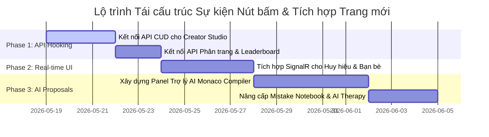

# Kế hoạch Tái cấu trúc & Hoàn thiện Hệ thống Nút bấm (Button Refactoring & Feature Expansion Plan)

Tài liệu này được biên soạn bởi Đội ngũ Lập trình viên Enterprise, dựa trên kết quả quét tĩnh từ [verify_buttons_report.md](file:///c:/code/asp.net/verify_buttons_report.md). Chúng tôi đưa ra lộ trình chi tiết để kết nối các sự kiện "nút chết", tối ưu hóa luồng dữ liệu (Data Flows) và đề xuất các trang/tính năng mới nhằm đưa **SmartLMS.AI** đạt chuẩn SaaS thương mại hoàn chỉnh.

---

## 🛠️ PHẦN 1: KẾ HOẠCH TÁI CẤU TRÚC CÁC LUỒNG SỰ KIỆN BỊ GIÁN ĐOẠN

Chúng tôi chia 131 cảnh báo nút bấm bị gián đoạn thành 4 cụm tính năng chính để triển khai đồng bộ:

### Cụm 1: Luồng Quản trị Giáo trình của Giảng viên (Creator Studio & Curriculum Flows)
*   **Các tệp bị ảnh hưởng:** [CourseManager.jsx](file:///c:/code/asp.net/react-test-frontend/src/pages/CourseManager.jsx), [Curriculum.cshtml](file:///c:/code/asp.net/SmartLMS.Web/Views/CourseManagement/Curriculum.cshtml), [Edit.cshtml](file:///c:/code/asp.net/SmartLMS.Web/Views/CourseManagement/Edit.cshtml).
*   **Hiện trạng:** Các nút bấm *"Thêm Chương"*, *"Lưu thứ tự"*, *"Xem bài học"*, *"Xử lý hàng loạt"* chỉ thay đổi state local tạm thời hoặc trỏ tới `#` mà không lưu lại vào cơ sở dữ liệu.
*   **Giải pháp Tái cấu trúc:**
    1.  **Kết nối API CUD:** Hook toàn bộ các nút này vào `CourseApiController.cs` thông qua Axios client. Khi giảng viên nhấn *"Thêm Chương"* hoặc *"Lưu thứ tự"*, client sẽ gửi payload lên endpoint để cập nhật `CourseModules` trong SQL Server.
    2.  **Sự kiện Studio:** Gán sự kiện `onClick` của nút "Studio" để nạp tự động thông tin chi tiết bài học qua API `/api/compiler/courses/{courseId}/lessons`.

### Cụm 2: Luồng Học tập & Compiler Playground của Học viên (Student Workspace Flows)
*   **Các tệp bị ảnh hưởng:** [StudyWorkspace.jsx](file:///c:/code/asp.net/react-test-frontend/src/pages/StudyWorkspace.jsx), [Courses.jsx](file:///c:/code/asp.net/react-test-frontend/src/pages/Courses.jsx), [Leaderboard.jsx](file:///c:/code/asp.net/react-test-frontend/src/pages/Leaderboard.jsx).
*   **Hiện trạng:** Nút *"Tải thêm cao thủ"* trên bảng xếp hạng, hoặc các nút liên quan đến tab *"Điểm yếu của tôi"* và *"Tài liệu mở rộng"* đang bị chết hoặc chứa callback rỗng.
*   **Giải pháp Tái cấu trúc:**
    1.  **Phân trang Leaderboard:** Viết handler `fetchMoreLeaderboard` gọi API `/api/assessment/leaderboard?page=X` để tải thêm dữ liệu thay vì mock tĩnh.
    2.  **AI Weakness Suggestion:** Kết nối tab *"Điểm yếu của tôi"* với API ML.NET Predictor để lấy danh sách các lỗi biên dịch học viên hay mắc phải nhất (Mistakes Log) từ cơ sở dữ liệu và kết xuất phương án sửa lỗi bằng AI.

### Cụm 3: Luồng Gamification & Vinh danh (Gamification & Achievement Flows)
*   **Các tệp bị ảnh hưởng:** [BadgeStudio.cshtml](file:///c:/code/asp.net/SmartLMS.Web/Views/Assessment/BadgeStudio.cshtml), [MyLearning.jsx](file:///c:/code/asp.net/react-test-frontend/src/pages/MyLearning.jsx).
*   **Hiện trạng:** Các nút *"Tạo Huy hiệu mới"*, *"Lưu huy hiệu"*, *"Chỉnh sửa"* trong Badge Studio MVC chỉ thao tác với modal HTML tĩnh mà không kích hoạt logic trao thưởng thực tế.
*   **Giải pháp Tái cấu trúc:**
    1.  **Real-time Badge Broadcaster:** Kết nối nút *"Lưu huy hiệu"* với API `AssessmentService.cs` thông qua SignalR `NotificationHub`. Khi admin tạo/cập nhật huy hiệu, hệ thống phát thông báo real-time tới client React của tất cả học viên.
    2.  **Claim XP Event:** Khi học viên click các nút hoàn thành bài học, trigger sự kiện `_mediator.Publish(new LessonCompletedEvent(...))` để tự động cộng điểm XP và bắn pháo hoa ăn mừng trên UI.

### Cụm 4: Luồng Tương tác Cộng đồng & Booking (Community & Interaction Flows)
*   **Các tệp bị ảnh hưởng:** [CommunityFriends.jsx](file:///c:/code/asp.net/react-test-frontend/src/pages/CommunityFriends.jsx), [TutorDashboard.jsx](file:///c:/code/asp.net/react-test-frontend/src/pages/TutorDashboard.jsx).
*   **Hiện trạng:** Các nút *"Chấp nhận kết bạn"*, *"Từ chối"*, *"Duyệt lịch hẹn"* chỉ thay đổi trạng thái giao diện giả (mock state) mà chưa gửi tín hiệu giao tiếp thực.
*   **Giải pháp Tái cấu trúc:**
    1.  **SignalR Friend Requests:** Kết nối nút *"Chấp nhận"* với SignalR Hub để gửi thông báo kết bạn trực tiếp tới đối phương theo thời gian thực.
    2.  **Tutor Slot Booking Integration:** Gắn sự kiện cho nút *"Duyệt lịch"* để gọi API cập nhật trạng thái lịch hẹn của giảng viên từ DB.

---

## 🚀 PHẦN 2: ĐỀ XUẤT CÁC TRANG & TÍNH NĂNG ĐỘT PHÁ MỚI (NEW PROPOSALS)

Để tối ưu hóa trải nghiệm học tập và đưa nền tảng lên chuẩn SaaS cao cấp, chúng tôi đề xuất bổ sung thêm 3 trang chuyên biệt sau:

### 1. Trang Trợ lý Học tập AI Đồng hành (AI Learning Companion Panel)
*   **Vị trí đề xuất:** Một Panel trượt (Slide-over drawer) nằm trực tiếp ở góc phải màn hình Monaco Editor trong [StudyWorkspace.jsx](file:///c:/code/asp.net/react-test-frontend/src/pages/StudyWorkspace.jsx).
*   **Mô tả tính năng:**
    *   Khi học viên biên dịch code thất bại nhiều lần (kết quả hiển thị `FAILED` đỏ), nút **"Hỏi trợ lý AI"** sẽ sáng lên.
    *   Học viên click nút này, Trợ lý AI sẽ tự động phân tích mã nguồn hiện tại của học viên, đối chiếu với Test Case bị fail, và hiển thị gợi ý (XAI - Explainable AI) giải thích nguyên nhân lỗi thuật toán mà **không cho sẵn mã nguồn đáp án**.
    *   *Giá trị SaaS:* Tạo sự tương tác thông minh vượt trội, giảm tỷ lệ học viên bỏ cuộc giữa chừng.

### 2. Trang Quản lý Thử thách Lập trình Nhóm (Team Hackathon & Coding Battles Arena)
*   **Vị trí đề xuất:** Tích hợp trực tiếp vào thanh điều hướng bên cạnh tab Cộng đồng (`/arena`).
*   **Mô tả tính năng:**
    *   Học viên có thể nhấn nút **"Tạo phòng đấu Code (Coding Battle Room)"**.
    *   Màn hình thi đấu hiển thị bảng so tài song song: 2 học viên cùng giải quyết 1 bài tập Coding Sandbox. Bảng xếp hạng cập nhật thời gian thực dựa trên số testcases pass và tốc độ giải đề.
    *   *Công nghệ sử dụng:* SignalR Hub truyền nhận trạng thái biên dịch trực tiếp giữa 2 máy client.

### 3. Trang Nhật ký Lỗi & AI Trị liệu Học tập (Mistake Diary & AI Therapy)
*   **Vị trí đề xuất:** Nâng cấp từ trang [MistakeNotebook.jsx](file:///c:/code/asp.net/react-test-frontend/src/pages/MistakeNotebook.jsx) hiện tại.
*   **Mô tả tính năng:**
    *   Lưu trữ lịch sử tất cả các đoạn code bị lỗi biên dịch hoặc lỗi logic của học viên.
    *   Bổ sung nút **"AI Khắc phục Lỗ hổng (Remediation Plan)"** để hệ thống tự động sinh một lộ trình ôn tập gồm các bài giảng lý thuyết ngắn và bài tập code tương đương nhằm lấp đầy lỗ hổng kiến thức đó.

---

## 📅 PHẦN 3: LỘ TRÌNH TRIỂN KHAI CHI TIẾT (IMPLEMENTATION ROADMAP)



### Cách thức verify sau mỗi Phase:
Sau khi hoàn thành từng Phase, nhà phát triển PHẢI chạy lại công cụ kiểm tra tính toàn vẹn:
```bash
node verify_buttons.js
```
*Mục tiêu:* Giảm dần số lượng dead buttons từ **131** về **0** trước khi phát hành chính thức!
