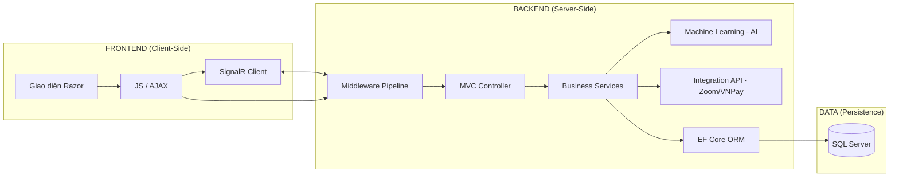

# 🏭 KIẾN TRÚC FRAMEWORK & LUỒNG TƯƠNG TÁC CHI TIẾT

Tài liệu này cung cấp cái nhìn sâu sắc nhất về hệ sinh thái công nghệ đang vận hành SmartLMS.AI, giúp bạn hiểu rõ "ai đang làm việc gì" trong hệ thống.

---

## 🏛️ 1. CÁC FRAMEWORKS "TRỤ CỘT" (DEEP DIVE)

### 🔵 .NET 8.0 (The Foundation)
Đây là nền tảng cốt lõi nhất. Nó không chỉ là ngôn ngữ lập trình mà là một môi trường chạy (Runtime) cực kỳ mạnh mẽ, đa nền tảng (chạy được trên cả Windows và Linux/Docker).
*   **Nhiệm vụ**: Quản lý bộ nhớ, chạy mã code, và cung cấp các thư viện cơ bản cho mọi thứ khác.

### 🟢 ASP.NET Core MVC (The Architecture)
Mô hình **Model-View-Controller** chia ứng dụng làm 3 phần:
*   **Model**: Chứa dữ liệu (Bảng biểu, thông tin khóa học).
*   **View**: Những gì bạn thấy trên màn hình (HTML/CSS).
*   **Controller**: "Người điều phối" nhận lệnh từ người dùng và ra lệnh cho Model/View.

### 🟠 Entity Framework Core 8.0 (The Bridge)
Đây là một **ORM (Object-Relational Mapper)**.
*   **Cách nó hoạt động**: Bạn không cần viết SQL khó nhằn. Bạn viết code C# (`_context.Courses.Add(newCourse)`), và EF Core tự động dịch nó thành lệnh SQL `INSERT INTO Courses...`.
*   **Tương tác**: Kết nối code của bạn với SQL Server một cách an toàn nhất.

### 🔴 SignalR (The Live Connection)
Thay vì người dùng phải nhấn F5 để xem dữ liệu mới, SignalR giữ một "sợi dây" kết nối liên tục giữa Server và Trình duyệt qua **WebSockets**.
*   **Ví dụ**: Khi học viên nộp bài, điểm số sẽ "ping" lên màn hình Admin ngay lập tức.

### 🟡 ML.NET (The Brain)
Tích hợp trí tuệ nhân tạo trực tiếp vào .NET mà không cần Python.
*   **Cách nó hoạt động**: Nó đọc dữ liệu từ DB, tìm ra các quy luật bỏ học, và "đóng băng" thành một Model file (file .zip). Khi cần dự báo, hệ thống chỉ việc nạp file này lên và tính toán.

---

## 🔄 2. HÀNH TRÌNH CỦA MỘT YÊU CẦU: TỪ FRONTEND ĐẾN BACKEND

Hãy tưởng tượng bạn nhấn nút **"Mua Khóa Học"**:

### Chặng 1: Frontend (Trình duyệt)
*   **Công nghệ**: Razor View (`.cshtml`), jQuery, Bootstrap.
*   **Hành động**: Trình duyệt đóng gói thông tin (ID khóa học, User ID) và gửi một yêu cầu **HTTP POST**.

### Chặng 2: Trạm thu phí (Middleware Pipeline)
Yêu cầu đi qua "đường ống" (hãy xem `middleware_pipeline.md`). Tại đây, hệ thống kiểm tra xem bạn đã đăng nhập chưa, có quyền mua không, và dữ liệu có bị mã độc không.

### Chặng 3: Điều phối viên (Controller)
*   **File**: `PaymentController.cs` hoặc `CourseController.cs`.
*   **Nghiệm vụ**: Nó nhận dữ liệu từ Frontend, kiểm tra logic (Khóa học này có còn bán không?).

### Chặng 4: Xử lý nghiệp vụ (Services)
*   **File**: `VNPayGateway.cs`, `CourseService.cs`.
*   **Nghiệm vụ**: Thực hiện các tác vụ nặng: Gọi sang ngân hàng VNPay để lấy link thanh toán, hoặc gọi AI để kiểm tra rủi ro.

### Chặng 5: Đích đến (Database)
*   **Công nghệ**: EF Core.
*   **Nghiệm vụ**: Lưu đơn hàng vào SQL Server. Sau khi SQL Server lưu xong, nó báo "OK" cho Backend.

### Chặng 6: Phản hồi (Response)
Backend đóng gói kết quả sang dạng **HTML (View)** hoặc **JSON** và gửi ngược lại cho trình duyệt. Trình duyệt hiển thị: "Thanh toán thành công!".

---

## 🧱 3. SƠ ĐỒ PHỐI HỢP CHI TIẾT

---

## 📄 FILE KIỂM CHỨNG (WHERE TO FIND?)
Nếu bạn muốn thấy các framework này được khai báo ở đâu, hãy xem:
- **Khai báo gói**: [SmartLMS.Web.csproj](file:///c:/code/asp.net/SmartLMS.Web/SmartLMS.Web.csproj)
- **Khai báo vận hành**: [Program.cs](file:///c:/code/asp.net/SmartLMS.Web/Program.cs)

---
*Tài liệu được biên soạn bởi Antigravity AI - Trợ lý của bạn.*
