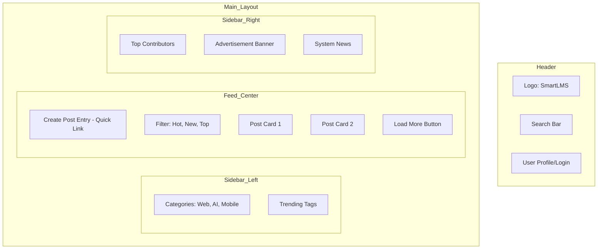

# 🎨 Thiết Kế Giao Diện Trang Cộng Đồng (Community UI/UX)

Tài liệu này mô phỏng các khung giao diện (Wireframes) và tên gọi các thành phần (Elements) để chuẩn bị cho việc code giao diện bằng Tailwind CSS + DaisyUI.

---

## 1. Trang Chủ (Feed / Index Page)
Đây là trang người dùng nhìn thấy đầu tiên khi vào IP của VPS-A.

### Khung giao diện (Wireframe)

### Chi tiết các Element quan trọng:
1.  **Post Card (Thẻ bài viết):**
    *   `Avatar & Username`: Người đăng.
    *   `Post Title`: Tiêu đề bài viết (Font-bold, Hover:text-primary).
    *   `Excerpt`: Một đoạn nội dung ngắn mô tả bài viết.
    *   `Vote Box`: Nút Upvote/Downvote và số điểm (Bên trái hoặc dưới cùng).
    *   `Meta Info`: Số bình luận, thời gian đăng, Tag bài viết.
2.  **Category Menu:** Dùng DaisyUI `Menu` component với hiệu ứng kính mờ (Glassmorphism).

---

## 2. Trang Chi Tiết Bài Viết (Post Detail Page)
Giao diện tập trung vào việc đọc nội dung và thảo luận.

### Cấu trúc Elements:
*   `Breadcrumb`: Home > Web Development > Title.
*   `Article Header`: Tiêu đề lớn (h1), ngày cập nhật, tác giả.
*   `Article Content`: Render từ Markdown, hỗ trợ Highlight Code (Prism.js).
*   `Author Box`: Giới thiệu ngắn về tác giả và nút "Theo dõi".
*   `Comment Section`:
    *   `Comment Editor`: Ô nhập bình luận với Markdown.
    *   `Comment Thread`: Danh sách bình luận dạng cây (nested), mỗi bình luận có nút Reply và Vote riêng.

---

## 3. Trang Đăng Bài (Create/Edit Post Page)
Giao diện tập trung vào sự tối giản để người dùng không bị xao nhãng.

### Các thành phần chính:
*   `Input Title`: Ô nhập tiêu đề cỡ lớn, không viền.
*   `Tag Selector`: Chọn các chuyên mục liên quan (dùng DaisyUI `Badge` hoặc `Select2`).
*   `Markdown Editor`: Ô nhập nội dung chia sẻ (chia đôi màn hình: bên trái nhập, bên phải Preview).
*   `Publish Button`: Nút nổi bật (bg-primary) ở góc trên bên phải.

---

## 4. Bảng Màu & Typography (Design Tokens)
*   **Màu chủ đạo (Primary):** Indigo-600 (`#4f46e5`) - Tạo cảm giác tin cậy, học thuật.
*   **Màu nhấn (Accent):** Emerald-500 (`#10b981`) - Dùng cho các nút "Thành công", "Đăng bài".
*   **Chế độ (Mode):** Hỗ trợ Dark Mode (DaisyUI `dark` theme).
*   **Font chữ:** `Inter` hoặc `Roboto` (Google Fonts) để tối ưu khả năng đọc.
