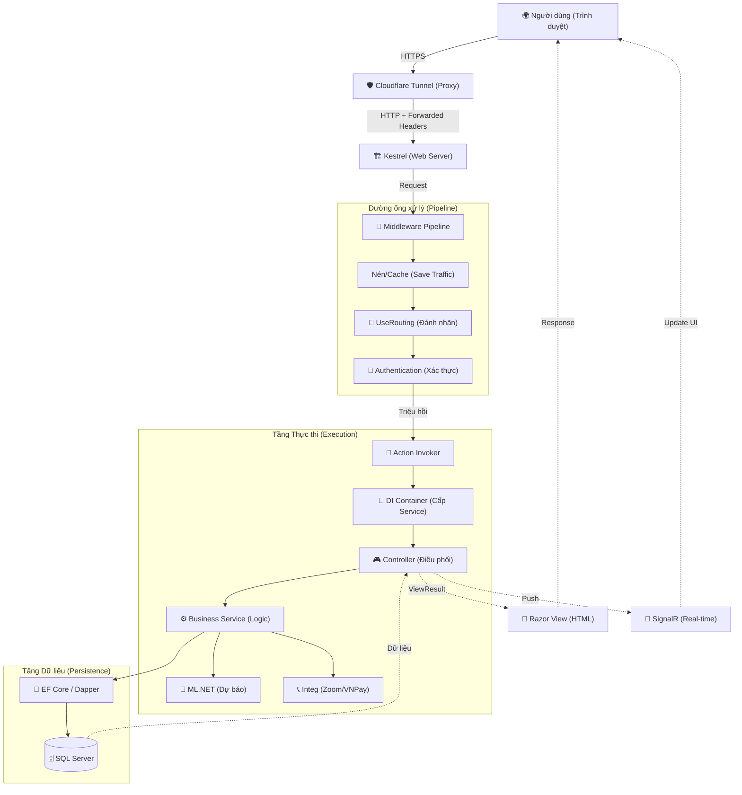

# 🗺️ SIÊU BẢN ĐỒ: LUỒNG DỮ LIỆU TỔNG THỂ (ULTIMATE FLOW)

Tài liệu này là bản hợp nhất tinh hoa từ toàn bộ 8 file tài liệu trước đó, giúp bạn hiểu trọn vẹn "vòng đời" của một yêu cầu từ lúc người dùng click chuột cho đến khi dữ liệu nằm im trong Database.

---

## 📊 1. SIÊU SƠ ĐỒ TOÀN CẢNH (MASTER DIAGRAM)

---

## 📂 2. MỐI LIÊN KẾT GIỮA CÁC TÀI LIỆU (THE KNOWLEDGE NET)

Để hiểu sâu từng phần trong sơ đồ trên, bạn hãy đối chiếu với các file sau:

1.  **Giai đoạn Vào (Network)**: Xem [kestrel.md](file:///c:/code/asp.net/kestrel.md). Giải thích cách Cloudflare và Kestrel phối hợp.
2.  **Giai đoạn Lọc (Pipeline)**: Xem [middleware_pipeline.md](file:///c:/code/asp.net/middleware_pipeline.md). Giải thích 11 lớp lọc dữ liệu.
3.  **Giai đoạn Chọn (Routing)**: Xem [routingandendpoint.md](file:///c:/code/asp.net/routingandendpoint.md) và [routingmidleware.md](file:///c:/code/asp.net/routingmidleware.md). Giải thích cách tìm đúng Controller.
4.  **Giai đoạn Khởi tạo (DI)**: Xem [DI.md](file:///c:/code/asp.net/DI.md). Giải thích cách các Service được "tiêm" vào Controller.
5.  **Giai đoạn Xử lý (Logic)**: Xem [services.md](file:///c:/code/asp.net/services.md). Giải thích vai trò của từng ông "thợ" Service.
6.  **Giai đoạn Nền tảng**: Xem [framework.md](file:///c:/code/asp.net/framework.md). Giải thích các công nghệ .NET 8, SignalR, ML.NET.

---

## 💡 3. TƯ DUY HỆ THỐNG (SYSTEM THINKING)

Khi bạn muốn thêm một tính năng mới (ví dụ: Chấm điểm bằng AI), bạn hãy tư duy theo sơ đồ này:
- **UI**: Thêm nút bấm ở View.
- **Routing**: URL đó sẽ dẫn về đâu?
- **DI**: Cần thêm Service nào cho AI?
- **Logic**: Viết code xử lý trong Service.
- **Data**: Lưu kết quả vào SQL Server.

---
*Tài liệu được biên soạn bởi Antigravity AI - Trực diện và Toàn cảnh.*
