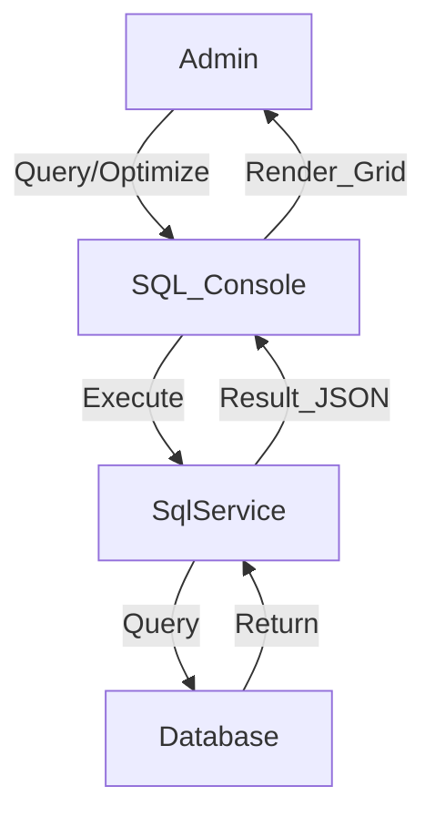

# Danh sách Use Case - Hệ thống SmartLMS.AI

Tài liệu này mô tả các tình huống sử dụng thực tế của 3 đối tượng chính: Quản trị viên (Admin), Sinh viên (Student) và Hệ thống AI.

## 1. Đối với Quản trị viên (Admin)
| Mã | Use Case | Mô tả | Lợi ích |
| :--- | :--- | :--- | :--- |
| **UC-01** | Theo dõi Dashboard AI | Xem thống kê số lượng sinh viên, tỷ lệ hoàn thành môn học và tỷ lệ rủi ro bỏ học trung bình toàn hệ thống. | Giúp có cái nhìn tổng quát về sức khỏe của các khóa học. |
| **UC-02** | Quản lý Khóa học (CRUD) | Thêm môn học mới, cập nhật mô tả và chỉ số "BaseSalaryImpact" (ảnh hưởng lương dự kiến). | Giúp dữ liệu AI luôn mới và chính xác. |
| **UC-03** | Can thiệp sớm (Intervention) | Nhận danh sách sinh viên có rủi ro bỏ học cao (High Risk) để gửi email nhắc nhở hoặc hỗ trợ. | Giảm tỷ lệ sinh viên bỏ học nửa chừng. |
| **UC-04** | Theo dõi Activity Logs | Xem lịch sử thao tác của sinh viên trên hệ thống (đăng nhập, thời gian học). | Hiểu được hành vi người dùng. |

## 2. Đối với Sinh viên (Student)
| Mã | Use Case | Mô tả | Lợi ích |
| :--- | :--- | :--- | :--- |
| **UC-05** | Đăng ký Khóa học | Chọn và đăng ký các khóa học phù hợp với định hướng nghề nghiệp. | Bắt đầu lộ trình học tập. |
| **UC-06** | Theo dõi Tiến độ | Xem mình đã hoàn thành bao nhiêu % môn học và điểm trung bình hiện tại qua AJAX dashboard. | Tạo động lực học tập. |
| **UC-07** | Xem Dự báo Năng lực | Xem dự báo về mức thu nhập hoặc sự thay đổi năng lực sau khi hoàn thành khóa học (tương lai). | Định hướng nghề nghiệp rõ ràng hơn. |

## 3. Đối với Hệ thống AI (System AI)
| Mã | Use Case | Mô tả | Lợi ích |
| :--- | :--- | :--- | :--- |
| **UC-08** | Huấn luyện mô hình (Training) | Tự động quét bảng `Enrollments` và `ActivityLogs` để cập nhật trọng số mô hình ML.NET. | Đảm bảo dự báo ngày càng chính xác. |
| **UC-09** | Gán nhãn rủi ro (Labeling) | Phân tích `Progress` và `AvgScore` để gán nhãn rủi ro cho từng sinh viên theo thời gian thực. | Cung cấp dữ liệu đầu vào cho Dashboard. |

---

## 4. Technical Interaction Flow (Frontend ⇆ Backend)

Hệ thống sử dụng mô hình **AJAX-First Interaction** để đảm bảo trải nghiệm người dùng mượt mà (SPA-like experience):

| Tầng | Công nghệ / Thư viện | Vai trò |
| :--- | :--- | :--- |
| **Frontend (UI)** | AdminLTE 3.2, Bootstrap 4 | Cung cấp giao diện chuẩn Admin, di động và hiện đại. |
| **Interaction** | jQuery & AJAX | Gửi yêu cầu bất đồng bộ từ người dùng tới Server. |
| **Data Grid** | DataTables.net (Select, Scroller) | Hiển thị, tìm kiếm và thao tác hàng loạt (Bulk Actions) trên dữ liệu lớn. |
| **Backend (Logic)** | ASP.NET Core 8.0 (MVC) | Điều phối trung tâm, xác thực và xử lý nghiệp vụ. |
| **Service Layer** | Business Services (Dapper) | Thực thi logic nghiệp vụ và truy vấn SQL hiệu năng cao. |
| **Database** | SQL Server (T-SQL) | Lưu trữ dữ liệu an toàn, hỗ trợ Indexing và Auditing. |

### Ví dụ Luồng UC-10: SmartDB Master Console
1. **User**: Nhập SQL vào Console và bấm mang lệnh Run (Ctrl+Enter).
2. **Frontend**: Gửi JSON payload `/SqlManagement/Execute` qua AJAX.
3. **Backend**: `SqlManagementController` nhận yêu cầu, kiểm tra an toàn.
4. **Service**: `SqlService` sử dụng Dapper thực thi chuỗi SQL động, đồng thời ghi log vào bảng `SqlAuditLogs`.
5. **Result**: Trả về dữ liệu dạng JSON dynamic, Frontend render thành bảng HTML tự động.

## 5. Danh mục Thư viện tích hợp

- **Giao diện**: AdminLTE, Bootstrap 4, FontAwesome 5, Lucide Icons.
- **Tương tác**: jQuery, SweetAlert2 (Thông báo), Toastr (Báo tin nhắn nhanh).
- **Dữ liệu & Cấu trúc**: DataTables (Quản lý bảng), jsTree (Quản lý đề cương cây), jQuery Sparklines (Biểu đồ xu hướng).
- **Backend**: Dapper (Micro-ORM), Microsoft.Data.SqlClient (Kết nối DB), Newtonsoft.Json (Xử lý chuỗi).

---

## Mối liên hệ chính (Relationship Flow)

