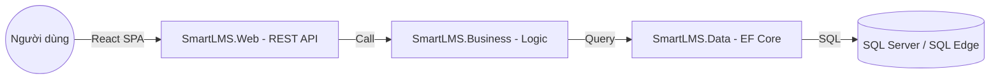

# Phân tích Kiến trúc Hệ thống SmartLMS.AI

Dựa trên cấu trúc mã nguồn hiện tại, tôi đã thực hiện nghiên cứu chuyên sâu để giải thích cho bạn về cơ chế vận hành của hệ thống này.

## 1. Kết luận: Đây là kiến trúc MONOLITH (Đơn khối)
Hệ thống SmartLMS.AI hiện tại được xây dựng theo kiến trúc **Monolith** (cụ thể là **Layered Monolith - Đơn khối phân tầng**). 

### Tại sao lại là Monolith?
*   **Mã nguồn tập trung:** Toàn bộ các layer (Web, Business, Data, Models) đều nằm trong cùng một Solution (`SmartLMS.sln`) và được biên dịch thành một đơn vị triển khai duy nhất.
*   **Chia sẻ Database:** Toàn bộ hệ thống sử dụng chung một cơ sở dữ liệu duy nhất (`SmartLMSContext`).
*   **Giao tiếp nội bộ:** Các thành phần gọi nhau trực tiếp qua bộ nhớ (In-memory calls) thay vì qua mạng (Network calls). Ví dụ: `CoursesApiController` gọi trực tiếp đến `ICourseService` trong project `SmartLMS.Business`.

---

## 2. Vai trò "Web Services" trong hệ thống này
Mặc dù là Monolith, nhưng hệ thống vẫn sử dụng cơ chế **Web Services** (dưới dạng **RESTful API**) để giao tiếp với bên ngoài:

*   **Backend as a Service:** Project `SmartLMS.Web` đóng vai trò là một "Máy cung cấp dịch vụ". 
*   **Tách biệt Frontend/Backend:** Bạn có `react-test-frontend` (React SPA) và `laravel-enterprise-app`. Các ứng dụng này không can thiệp vào code của C#, chúng chỉ gửi yêu cầu HTTP (GET, POST, PUT, DELETE) đến `SmartLMS.Web`.
*   **Dữ liệu JSON:** Dữ liệu được trao đổi qua lại dưới dạng JSON - tiêu chuẩn vàng của Web Services hiện đại.

---

## 3. So sánh với Microservices
Để bạn dễ hình dung, nếu chuyển sang **Microservices**, hệ thống sẽ trông như sau:
1.  **Course Service:** Một project riêng, DB riêng chỉ quản lý khóa học.
2.  **User Service:** Một project riêng quản lý người dùng.
3.  **AI Prediction Service:** Một dịch vụ riêng chạy Python hoặc .NET chỉ để dự báo.
4.  **API Gateway:** Một cửa ngõ duy nhất để điều phối yêu cầu.

> [!NOTE]
> **Hiện trạng:** SmartLMS hiện tại là một Monolith rất "sạch" và có tổ chức. Nó phù hợp cho các doanh nghiệp vừa và nhỏ vì dễ triển khai, dễ debug và hiệu suất cao trên các máy chủ có tài nguyên giới hạn (như máy chủ Oracle 1GB RAM chúng ta đang dùng).

---

## 4. Mô hình luồng dữ liệu (Data Flow)

Hệ thống của bạn đang đi theo hướng **"Modern Monolith"** - nghĩa là bên trong là đơn khối để dễ quản lý, nhưng bên ngoài cung cấp Web Services để có thể mở rộng sang nhiều loại Client khác nhau (Web, App Mobile, IoT).
