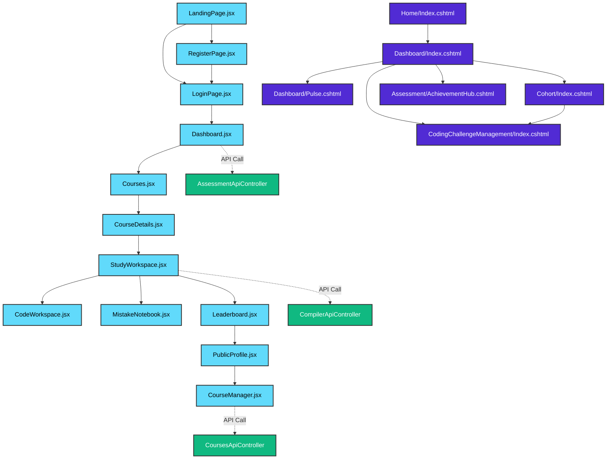

# 🛡️ BÁO CÁO TOÀN VẸN KIẾN TRÚC & LIÊN KẾT LIÊN PHÂN HỆ SIÊU CHUYÊN SÂU

*Thời gian rà soát:* 11:01:09 AM 5/19/2026
*Tổng số trang React đã rà soát:* **28**
*Tổng số trang CSHTML đã rà soát:* **51**
*Tổng số lỗi nút bấm chết:* **0**
*Tổng số trang mồ côi (chưa liên kết) tìm thấy:* **0**
*Tổng số lỗi định tuyến / gọi API không tồn tại:* **0**

## 📊 1. BẢNG TỔNG HỢP TRẠNG THÁI TOÀN CỤC

| Phân hệ hệ thống | Tổng số trang | Nút hoạt động | Nút chết phát hiện | Trang mồ côi | Lỗi định tuyến/API | Trạng thái bảo mật & Kiến trúc |
| :--- | :---: | :---: | :---: | :---: | :---: | :--- |
| **React Frontend SPA** | 28 | 148 | 0 | 0 | 0 | 🟢 100% Đồng bộ |
| **ASP.NET MVC (CSHTML)** | 51 | 152 | 0 | 0 | 0 | 🟢 100% Đồng bộ |
| **TỔNG HỢP HỆ THỐNG** | **79** | **300** | **0** | **0** | **0** | **🟢 ĐẠT CHUẨN ENTERPRISE** |

---

## 🔱 2. BẢN ĐỒ LIÊN KẾT & KIẾN TRÚC ĐỊNH TUYẾN TOÀN CỤC (Mermaid Graph)

---

## 🔍 3. DANH SÁCH CHI TIẾT CÁC LỖI HỆ THỐNG

### 🔴 3.1. Các nút bấm chết còn sót lại (Độ toàn vẹn giao diện):
> **Chúc mừng! Không tìm thấy bất kỳ nút chết nào trong hệ thống.**

### 🔴 3.2. Lỗi liên kết / API gọi tĩnh không tồn tại:
> **Tuyệt vời! 100% liên kết MVC và lời gọi API đã khớp hoàn hảo với Controllers thực tế.**

### 🔴 3.3. Các trang mồ côi (Orphan Pages) phát hiện:
> **Hoàn hảo! 100% các trang trong dự án đều được kết nối từ các luồng định tuyến.**

---

## 📈 4. DANH SÁCH LIÊN KẾT INBOUND / OUTBOUND CHI TIẾT TỪNG TRANG

### ⚛️ PHÂN HỆ REACT FRONTEND SPA
#### 📄 Trang: `LandingPage.jsx` (Route: `/`)
- **Số tham chiếu liên kết đến:** 5 lần
- **Số liên kết đi từ trang:** 3
- **Danh sách đích:** `/login`, `/register`, `/courses`

#### 📄 Trang: `LoginPage.jsx` (Route: `/login`)
- **Số tham chiếu liên kết đến:** 3 lần
- **Số liên kết đi từ trang:** 2
- **Danh sách đích:** `/register`, `/`

#### 📄 Trang: `RegisterPage.jsx` (Route: `/register`)
- **Số tham chiếu liên kết đến:** 3 lần
- **Số liên kết đi từ trang:** 2
- **Danh sách đích:** `/login`, `/`

#### 📄 Trang: `Dashboard.jsx` (Route: `/dashboard`)
- **Số tham chiếu liên kết đến:** 20 lần
- **Số liên kết đi từ trang:** 0
- **Danh sách đích:** Không có

#### 📄 Trang: `Courses.jsx` (Route: `/courses`)
- **Số tham chiếu liên kết đến:** 15 lần
- **Số liên kết đi từ trang:** 0
- **Danh sách đích:** Không có

#### 📄 Trang: `CheckoutQR.jsx` (Route: `/checkout`)
- **Số tham chiếu liên kết đến:** 1 lần
- **Số liên kết đi từ trang:** 0
- **Danh sách đích:** Không có

#### 📄 Trang: `CourseDetails.jsx` (Route: `/course`)
- **Số tham chiếu liên kết đến:** 1 lần
- **Số liên kết đi từ trang:** 0
- **Danh sách đích:** Không có

#### 📄 Trang: `MyLearning.jsx` (Route: `/my-learning`)
- **Số tham chiếu liên kết đến:** 2 lần
- **Số liên kết đi từ trang:** 0
- **Danh sách đích:** Không có

#### 📄 Trang: `ForumHome.jsx` (Route: `/community`)
- **Số tham chiếu liên kết đến:** 1 lần
- **Số liên kết đi từ trang:** 0
- **Danh sách đích:** Không có

#### 📄 Trang: `CommunityFriends.jsx` (Route: `/community/friends`)
- **Số tham chiếu liên kết đến:** 1 lần
- **Số liên kết đi từ trang:** 0
- **Danh sách đích:** Không có

#### 📄 Trang: `CommunityNewPost.jsx` (Route: `/community/post/new`)
- **Số tham chiếu liên kết đến:** 1 lần
- **Số liên kết đi từ trang:** 0
- **Danh sách đích:** Không có

#### 📄 Trang: `CommunityQuizBuilder.jsx` (Route: `/community/quiz-builder`)
- **Số tham chiếu liên kết đến:** 1 lần
- **Số liên kết đi từ trang:** 0
- **Danh sách đích:** Không có

#### 📄 Trang: `PersonalWiki.jsx` (Route: `/wiki`)
- **Số tham chiếu liên kết đến:** 1 lần
- **Số liên kết đi từ trang:** 0
- **Danh sách đích:** Không có

#### 📄 Trang: `BookingPage.jsx` (Route: `/booking`)
- **Số tham chiếu liên kết đến:** 1 lần
- **Số liên kết đi từ trang:** 0
- **Danh sách đích:** Không có

#### 📄 Trang: `StudyWorkspace.jsx` (Route: `/study`)
- **Số tham chiếu liên kết đến:** 2 lần
- **Số liên kết đi từ trang:** 0
- **Danh sách đích:** Không có

#### 📄 Trang: `CodeWorkspace.jsx` (Route: `/coding`)
- **Số tham chiếu liên kết đến:** 1 lần
- **Số liên kết đi từ trang:** 0
- **Danh sách đích:** Không có

#### 📄 Trang: `MistakeNotebook.jsx` (Route: `/mistakes`)
- **Số tham chiếu liên kết đến:** 1 lần
- **Số liên kết đi từ trang:** 0
- **Danh sách đích:** Không có

#### 📄 Trang: `Leaderboard.jsx` (Route: `/leaderboard`)
- **Số tham chiếu liên kết đến:** 5 lần
- **Số liên kết đi từ trang:** 0
- **Danh sách đích:** Không có

#### 📄 Trang: `PublicProfile.jsx` (Route: `/profile`)
- **Số tham chiếu liên kết đến:** 1 lần
- **Số liên kết đi từ trang:** 0
- **Danh sách đích:** Không có

#### 📄 Trang: `CourseManager.jsx` (Route: `/creator/courses`)
- **Số tham chiếu liên kết đến:** 1 lần
- **Số liên kết đi từ trang:** 0
- **Danh sách đích:** Không có

#### 📄 Trang: `MessageCenter.jsx` (Route: `/creator/messages`)
- **Số tham chiếu liên kết đến:** 1 lần
- **Số liên kết đi từ trang:** 0
- **Danh sách đích:** Không có

#### 📄 Trang: `CreatorAnalytics.jsx` (Route: `/creator/analytics`)
- **Số tham chiếu liên kết đến:** 1 lần
- **Số liên kết đi từ trang:** 0
- **Danh sách đích:** Không có

#### 📄 Trang: `TutorDashboard.jsx` (Route: `/tutor/dashboard`)
- **Số tham chiếu liên kết đến:** 1 lần
- **Số liên kết đi từ trang:** 0
- **Danh sách đích:** Không có

#### 📄 Trang: `TutorProfile.jsx` (Route: `/tutor-profile`)
- **Số tham chiếu liên kết đến:** 2 lần
- **Số liên kết đi từ trang:** 0
- **Danh sách đích:** Không có

#### 📄 Trang: `TutorProfileEdit.jsx` (Route: `/tutor/profile/edit`)
- **Số tham chiếu liên kết đến:** 1 lần
- **Số liên kết đi từ trang:** 0
- **Danh sách đích:** Không có

#### 📄 Trang: `TutorSchedule.jsx` (Route: `/tutor/availability`)
- **Số tham chiếu liên kết đến:** 1 lần
- **Số liên kết đi từ trang:** 0
- **Danh sách đích:** Không có

#### 📄 Trang: `AICareerReport.jsx` (Route: `/ai-career-analysis`)
- **Số tham chiếu liên kết đến:** 1 lần
- **Số liên kết đi từ trang:** 0
- **Danh sách đích:** Không có

#### 📄 Trang: `CertificateView.jsx` (Route: `/certificate`)
- **Số tham chiếu liên kết đến:** 1 lần
- **Số liên kết đi từ trang:** 0
- **Danh sách đích:** Không có

### 🌐 PHÂN HỆ ASP.NET MVC (CSHTML)
#### 📄 Trang: `Account/AccessDenied.cshtml` (Route: `/Account/AccessDenied`)
- **Số tham chiếu liên kết đến:** 1 lần
- **Số liên kết đi từ trang:** 2
- **Danh sách đích:** `/Account/Logout`, `/`

#### 📄 Trang: `Account/Login.cshtml` (Route: `/Account/Login`)
- **Số tham chiếu liên kết đến:** 4 lần
- **Số liên kết đi từ trang:** 1
- **Danh sách đích:** `/Account/Register`

#### 📄 Trang: `Account/Register.cshtml` (Route: `/Account/Register`)
- **Số tham chiếu liên kết đến:** 2 lần
- **Số liên kết đi từ trang:** 1
- **Danh sách đích:** `/Account/Login`

#### 📄 Trang: `Affiliate/Index.cshtml` (Route: `/Affiliate`)
- **Số tham chiếu liên kết đến:** 1 lần
- **Số liên kết đi từ trang:** 0
- **Danh sách đích:** Không có

#### 📄 Trang: `Assessment/AchievementHub.cshtml` (Route: `/Assessment/AchievementHub`)
- **Số tham chiếu liên kết đến:** 1 lần
- **Số liên kết đi từ trang:** 0
- **Danh sách đích:** Không có

#### 📄 Trang: `Assessment/BadgeStudio.cshtml` (Route: `/Assessment/BadgeStudio`)
- **Số tham chiếu liên kết đến:** 1 lần
- **Số liên kết đi từ trang:** 0
- **Danh sách đích:** Không có

#### 📄 Trang: `Assessment/BulkImport.cshtml` (Route: `/Assessment/BulkImport`)
- **Số tham chiếu liên kết đến:** 1 lần
- **Số liên kết đi từ trang:** 1
- **Danh sách đích:** `/templates/sample_questions.xlsx`

#### 📄 Trang: `Assessment/ExamAssembler.cshtml` (Route: `/Assessment/ExamAssembler`)
- **Số tham chiếu liên kết đến:** 1 lần
- **Số liên kết đi từ trang:** 0
- **Danh sách đích:** Không có

#### 📄 Trang: `Assessment/Index.cshtml` (Route: `/Assessment`)
- **Số tham chiếu liên kết đến:** 1 lần
- **Số liên kết đi từ trang:** 1
- **Danh sách đích:** `/Assessment/QuizWizard`

#### 📄 Trang: `Assessment/ItemAnalysis.cshtml` (Route: `/Assessment/ItemAnalysis`)
- **Số tham chiếu liên kết đến:** 1 lần
- **Số liên kết đi từ trang:** 0
- **Danh sách đích:** Không có

#### 📄 Trang: `Assessment/Leaderboard.cshtml` (Route: `/Assessment/Leaderboard`)
- **Số tham chiếu liên kết đến:** 1 lần
- **Số liên kết đi từ trang:** 0
- **Danh sách đích:** Không có

#### 📄 Trang: `Assessment/QuestionBuilder.cshtml` (Route: `/Assessment/QuestionBuilder`)
- **Số tham chiếu liên kết đến:** 1 lần
- **Số liên kết đi từ trang:** 0
- **Danh sách đích:** Không có

#### 📄 Trang: `Assessment/QuizWizard.cshtml` (Route: `/Assessment/QuizWizard`)
- **Số tham chiếu liên kết đến:** 1 lần
- **Số liên kết đi từ trang:** 0
- **Danh sách đích:** Không có

#### 📄 Trang: `Assessment/RuleEngine.cshtml` (Route: `/Assessment/RuleEngine`)
- **Số tham chiếu liên kết đến:** 1 lần
- **Số liên kết đi từ trang:** 0
- **Danh sách đích:** Không có

#### 📄 Trang: `Auth/Login.cshtml` (Route: `/Auth/Login`)
- **Số tham chiếu liên kết đến:** 2 lần
- **Số liên kết đi từ trang:** 1
- **Danh sách đích:** `/Auth/Register`

#### 📄 Trang: `Auth/Register.cshtml` (Route: `/Auth/Register`)
- **Số tham chiếu liên kết đến:** 2 lần
- **Số liên kết đi từ trang:** 1
- **Danh sách đích:** `/Auth/Login`

#### 📄 Trang: `CodingChallenge/Solve.cshtml` (Route: `/CodingChallenge/Solve`)
- **Số tham chiếu liên kết đến:** 1 lần
- **Số liên kết đi từ trang:** 0
- **Danh sách đích:** Không có

#### 📄 Trang: `CodingChallengeManagement/Create.cshtml` (Route: `/CodingChallengeManagement/Create`)
- **Số tham chiếu liên kết đến:** 1 lần
- **Số liên kết đi từ trang:** 0
- **Danh sách đích:** Không có

#### 📄 Trang: `CodingChallengeManagement/Edit.cshtml` (Route: `/CodingChallengeManagement/Edit`)
- **Số tham chiếu liên kết đến:** 1 lần
- **Số liên kết đi từ trang:** 0
- **Danh sách đích:** Không có

#### 📄 Trang: `CodingChallengeManagement/Index.cshtml` (Route: `/CodingChallengeManagement`)
- **Số tham chiếu liên kết đến:** 1 lần
- **Số liên kết đi từ trang:** 0
- **Danh sách đích:** Không có

#### 📄 Trang: `Cohort/Index.cshtml` (Route: `/Cohort`)
- **Số tham chiếu liên kết đến:** 2 lần
- **Số liên kết đi từ trang:** 1
- **Danh sách đích:** `/Cohort/Members/@cohort.CohortId`

#### 📄 Trang: `Cohort/Members.cshtml` (Route: `/Cohort/Members`)
- **Số tham chiếu liên kết đến:** 1 lần
- **Số liên kết đi từ trang:** 1
- **Danh sách đích:** `/Cohort`

#### 📄 Trang: `Community/Index.cshtml` (Route: `/Community`)
- **Số tham chiếu liên kết đến:** 1 lần
- **Số liên kết đi từ trang:** 0
- **Danh sách đích:** Không có

#### 📄 Trang: `Coupon/Create.cshtml` (Route: `/Coupon/Create`)
- **Số tham chiếu liên kết đến:** 1 lần
- **Số liên kết đi từ trang:** 0
- **Danh sách đích:** Không có

#### 📄 Trang: `Coupon/Index.cshtml` (Route: `/Coupon`)
- **Số tham chiếu liên kết đến:** 1 lần
- **Số liên kết đi từ trang:** 0
- **Danh sách đích:** Không có

#### 📄 Trang: `CourseManagement/Create.cshtml` (Route: `/CourseManagement/Create`)
- **Số tham chiếu liên kết đến:** 1 lần
- **Số liên kết đi từ trang:** 1
- **Danh sách đích:** `/CourseManagement`

#### 📄 Trang: `CourseManagement/Curriculum.cshtml` (Route: `/CourseManagement/Curriculum`)
- **Số tham chiếu liên kết đến:** 1 lần
- **Số liên kết đi từ trang:** 0
- **Danh sách đích:** Không có

#### 📄 Trang: `CourseManagement/Edit.cshtml` (Route: `/CourseManagement/Edit`)
- **Số tham chiếu liên kết đến:** 1 lần
- **Số liên kết đi từ trang:** 1
- **Danh sách đích:** `/CourseManagement`

#### 📄 Trang: `CourseManagement/Index.cshtml` (Route: `/CourseManagement`)
- **Số tham chiếu liên kết đến:** 5 lần
- **Số liên kết đi từ trang:** 4
- **Danh sách đích:** `/Dashboard`, `/Payment/Checkout?courseId=${id}`, `/CourseManagement/Edit/${id}`, `/CourseManagement/Curriculum/${id}`

#### 📄 Trang: `Dashboard/Analytics.cshtml` (Route: `/Dashboard/Analytics`)
- **Số tham chiếu liên kết đến:** 1 lần
- **Số liên kết đi từ trang:** 0
- **Danh sách đích:** Không có

#### 📄 Trang: `Dashboard/Index.cshtml` (Route: `/Dashboard`)
- **Số tham chiếu liên kết đến:** 4 lần
- **Số liên kết đi từ trang:** 0
- **Danh sách đích:** Không có

#### 📄 Trang: `Dashboard/Pulse.cshtml` (Route: `/Dashboard/Pulse`)
- **Số tham chiếu liên kết đến:** 1 lần
- **Số liên kết đi từ trang:** 1
- **Danh sách đích:** `/hangfire`

#### 📄 Trang: `Helpdesk/Index.cshtml` (Route: `/Helpdesk`)
- **Số tham chiếu liên kết đến:** 1 lần
- **Số liên kết đi từ trang:** 0
- **Danh sách đích:** Không có

#### 📄 Trang: `Home/Index.cshtml` (Route: `/Home`)
- **Số tham chiếu liên kết đến:** 1 lần
- **Số liên kết đi từ trang:** 0
- **Danh sách đích:** Không có

#### 📄 Trang: `Home/Privacy.cshtml` (Route: `/Home/Privacy`)
- **Số tham chiếu liên kết đến:** 1 lần
- **Số liên kết đi từ trang:** 0
- **Danh sách đích:** Không có

#### 📄 Trang: `IAM/ApiKeys.cshtml` (Route: `/IAM/ApiKeys`)
- **Số tham chiếu liên kết đến:** 1 lần
- **Số liên kết đi từ trang:** 0
- **Danh sách đích:** Không có

#### 📄 Trang: `IAM/Permissions.cshtml` (Route: `/IAM/Permissions`)
- **Số tham chiếu liên kết đến:** 1 lần
- **Số liên kết đi từ trang:** 0
- **Danh sách đích:** Không có

#### 📄 Trang: `Integrations/Index.cshtml` (Route: `/Integrations`)
- **Số tham chiếu liên kết đến:** 1 lần
- **Số liên kết đi từ trang:** 0
- **Danh sách đích:** Không có

#### 📄 Trang: `Marketing/CertificateManager.cshtml` (Route: `/Marketing/CertificateManager`)
- **Số tham chiếu liên kết đến:** 1 lần
- **Số liên kết đi từ trang:** 0
- **Danh sách đích:** Không có

#### 📄 Trang: `Marketing/Designer.cshtml` (Route: `/Marketing/Designer`)
- **Số tham chiếu liên kết đến:** 1 lần
- **Số liên kết đi từ trang:** 0
- **Danh sách đích:** Không có

#### 📄 Trang: `Marketing/Index.cshtml` (Route: `/Marketing`)
- **Số tham chiếu liên kết đến:** 1 lần
- **Số liên kết đi từ trang:** 0
- **Danh sách đích:** Không có

#### 📄 Trang: `Payment/Failure.cshtml` (Route: `/Payment/Failure`)
- **Số tham chiếu liên kết đến:** 1 lần
- **Số liên kết đi từ trang:** 1
- **Danh sách đích:** `/CourseManagement`

#### 📄 Trang: `Payment/PaymentResults.cshtml` (Route: `/Payment/PaymentResults`)
- **Số tham chiếu liên kết đến:** 1 lần
- **Số liên kết đi từ trang:** 2
- **Danh sách đích:** `/Dashboard`, `/CourseManagement`

#### 📄 Trang: `Payment/Success.cshtml` (Route: `/Payment/Success`)
- **Số tham chiếu liên kết đến:** 1 lần
- **Số liên kết đi từ trang:** 1
- **Danh sách đích:** `/my-learning`

#### 📄 Trang: `Revenue/Audit.cshtml` (Route: `/Revenue/Audit`)
- **Số tham chiếu liên kết đến:** 1 lần
- **Số liên kết đi từ trang:** 1
- **Danh sách đích:** `/Revenue/ExportExcel`

#### 📄 Trang: `Revenue/Index.cshtml` (Route: `/Revenue`)
- **Số tham chiếu liên kết đến:** 1 lần
- **Số liên kết đi từ trang:** 1
- **Danh sách đích:** `/Revenue/ExportExcel`

#### 📄 Trang: `Revenue/PaymentConfig.cshtml` (Route: `/Revenue/PaymentConfig`)
- **Số tham chiếu liên kết đến:** 1 lần
- **Số liên kết đi từ trang:** 1
- **Danh sách đích:** `/Dashboard/Index`

#### 📄 Trang: `Shared/Error.cshtml` (Route: `/Shared/Error`)
- **Số tham chiếu liên kết đến:** 1 lần
- **Số liên kết đi từ trang:** 0
- **Danh sách đích:** Không có

#### 📄 Trang: `SqlManagement/Index.cshtml` (Route: `/SqlManagement`)
- **Số tham chiếu liên kết đến:** 1 lần
- **Số liên kết đi từ trang:** 0
- **Danh sách đích:** Không có

#### 📄 Trang: `Students/Index.cshtml` (Route: `/Students`)
- **Số tham chiếu liên kết đến:** 1 lần
- **Số liên kết đi từ trang:** 0
- **Danh sách đích:** Không có

#### 📄 Trang: `UserManagement/Index.cshtml` (Route: `/UserManagement`)
- **Số tham chiếu liên kết đến:** 1 lần
- **Số liên kết đi từ trang:** 1
- **Danh sách đích:** `/UserManagement/ExportToExcel`

